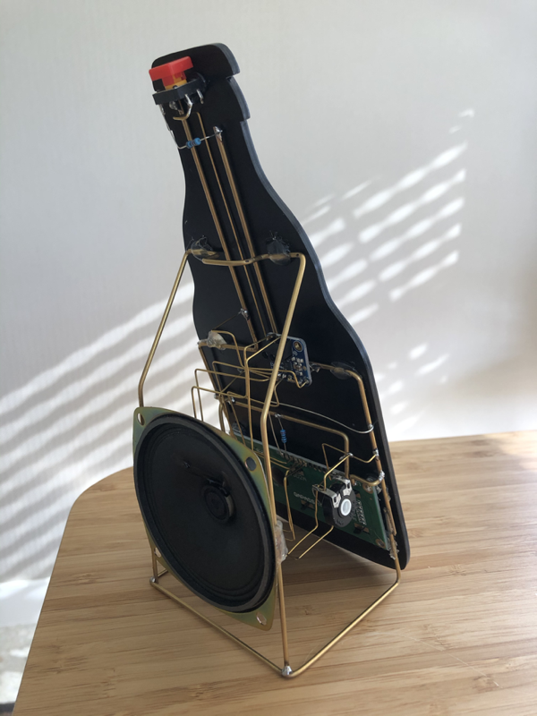

# Callboys Timer

## Introduction

This project is a wedding gift for Jeroen and Sarah, who said "Yes" to eachother on 28 May 2021. The gift consists of a Duvel-shaped and "Callboys"-themed kitchen timer which also reminds them of the amount of days they have been married.

## A picture or a 1000 words

## Components used

- [Wemos D1 ESP8266 board with 4Mb of flas](https://shop.mchobby.be/en/wemos-lolin-esp/1221-wemos-d1-mini-esp-8266ex-4mb-flash-3232100012219.html)
- [4 Ohm 3 Watt speaker](https://www.adafruit.com/product/1314)
- [16x2 character LCD](https://www.adafruit.com/product/181)
- [MAX 98357A I2S Amplifier](https://www.adafruit.com/product/3006)

# Libraries used

- LiquidCrystal to drive the characters LCD
- [NTPClient](https://github.com/arduino-libraries/NTPClient) to fetch the time in order to calculate the days they have been married
- [ESP8266WiFi](https://github.com/ekstrand/ESP8266wifi) to connect to Wifi
- [LittleFS](https://github.com/littlefs-project/littlefs) to upload and fetch the sound files from the 4Mb flash
- [AudioFileSourceHTTPStream, AudioGeneratorMP3, AudioOutputI2S](https://github.com/earlephilhower/ESP8266Audio) for outputting the sounds via the MAX 98357A I2S interface

## Enclosure

The Duvel bottle style front of the timer has been designed in Illustrator (source attached) and has been lasered on [TroLase](https://www.troteclaser.com/en/knowledge/laser-parameters/) acrylic using a Trotec Speedy100.

## Installation

1. Install the required libraries (cf above)
2. Setup the Wifi details in the config.h file (use the config.h.SAMPLE as a reference guide)
3. Perform all wiring as indicated above
4. Flash the code to the ESP8266 board
5. Enjoy!

## Thanks

Many thanks to all the authors of above libraries, and more generally to all the generous people contributing to the ESP8266 ecosystem.

